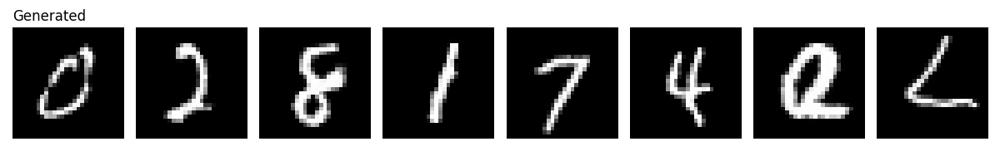
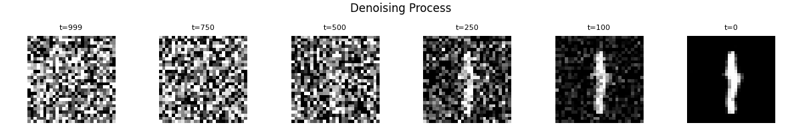
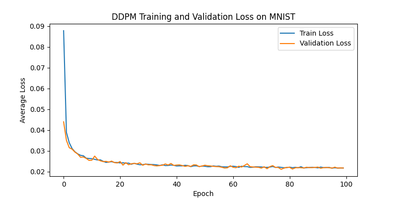

# DDPM-MNIST

A Denoising Diffusion Probabilistic Model (DDPM) implemented from scratch in PyTorch, trained on MNIST. Includes the forward noising process, a U-Net trained to predict noise, FID-based quantitative evaluation, and visualization of the iterative denoising trajectory.

## Architecture

- **Forward process**: Gaussian noise added over T = 1000 timesteps under a linear variance schedule (β₁ = 1e-4 → β_T = 0.02). Any noisy image x_t can be sampled directly in closed form from x₀ via the cumulative product ᾱ_t.
- **Reverse process (U-Net)**:
  - Initial conv (1→32 channels)
  - Two downsampling blocks (32→64→128 channels, 28×28 → 7×7)
  - Bottleneck block at 7×7
  - Two upsampling blocks with skip connections restoring 28×28
  - Final 1×1 conv producing the predicted noise map
- **Timestep conditioning**: Sinusoidal position embeddings (Transformer-style), projected into each conv block via a learned linear layer.
- **Normalization**: GroupNorm throughout, in place of BatchNorm, for stability at small sampling batch sizes.
- **Training objective**: Simplified DDPM loss — MSE between predicted and actual noise, equivalent to a weighted variational bound.

## Results

| Metric | Value |
|---|---|
| Final FID Score | **5.48** |
| Training epochs | 100 |
| Train / Val split | 80% / 20% (48,000 / 12,000 images) |
| Test set | 10,000 images (held out, used only for final FID) |
| Hardware | NVIDIA RTX 2080 |
| Best checkpoint | Epoch 78 (val loss 0.0211) |
| Train loss (epoch 1 → 100) | 0.0878 → 0.0217 |
| Optimizer | Adam, lr 2e-4, batch size 128 |
| Diffusion timesteps (T) | 1000 |

For context, this DDPM substantially outperforms both VAE variants trained under identical conditions (CNN-VAE FID 21.31, MLP-VAE FID 39.37) — see [vae-cnn-mnist](https://github.com/RaniaMostafa0/VAE-CNN-MNIST). The gap reflects DDPM's iterative refinement versus single-step VAE decoding.

### Generated Samples


Samples are generated by drawing pure Gaussian noise and applying 1000 sequential reverse-denoising steps. Output is noticeably sharper than VAE samples, since each step makes a small precise correction rather than averaging over pixel uncertainty in one pass.

### Denoising Process


Progressive denoising from pure noise (t=999) to a clean digit (t=0), shown at six intermediate timesteps.

### Training Curve


## Project Structure

- `model.py` — NoiseSchedule, TimeEmbedding, U-Net (ConvBlock/DownBlock/UpBlock), sampling function
- `train.py` — Training/validation loop
- `fid_score.py` — FID score computation
- `evaluate.py` — Visualizations (denoising process, generated samples, loss curve)
- `results/` — Generated plots and images
- `best_ddpm_weights.pth` — Best checkpoint (epoch 78, lowest val loss)
- `final_ddpm_weights.pth` — Final epoch checkpoint
- `losses.json` — Per-epoch train/val loss history
- `requirements.txt` — Python dependencies

## Setup

```bash
# Clone the repository
git clone https://github.com/RaniaMostafa0/ddpm-mnist.git
cd ddpm-mnist

# Create and activate a virtual environment
python -m venv venv
venv\Scripts\activate        # Windows
# source venv/bin/activate   # macOS/Linux

# Install PyTorch with CUDA support (adjust cu121 to match your CUDA version)
pip install torch torchvision --index-url https://download.pytorch.org/whl/cu121

# Install remaining dependencies
pip install -r requirements.txt
```

## Reproducing Results

```bash
# 1. Train the model (MNIST downloads automatically, ~100 epochs)
python train.py
# Saves: best_ddpm_weights.pth, final_ddpm_weights.pth, losses.json

# 2. Compute FID score against the held-out test set
python fid_score.py
# Saves: results/fid_score.json
# Expected: FID ≈ 5.48

# 3. Generate visualizations (denoising process, generated samples, loss curve)
python evaluate.py
# Saves: results/denoising_process.png, results/generated.png, results/training_loss.png
```

## Notes

- MNIST is downloaded automatically via `torchvision.datasets.MNIST` and excluded from version control (`.gitignore`).
